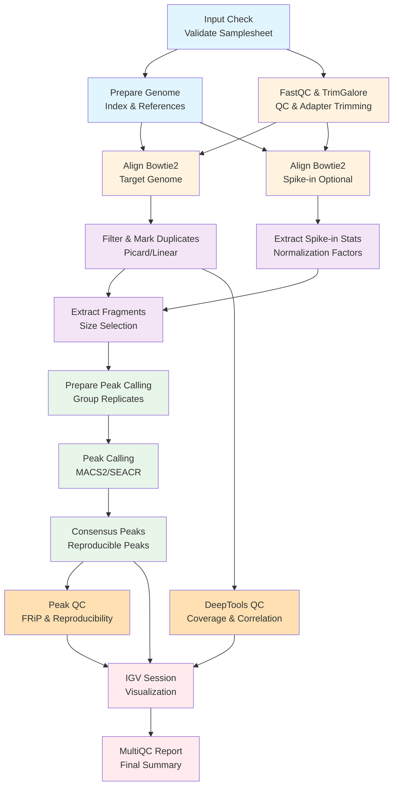
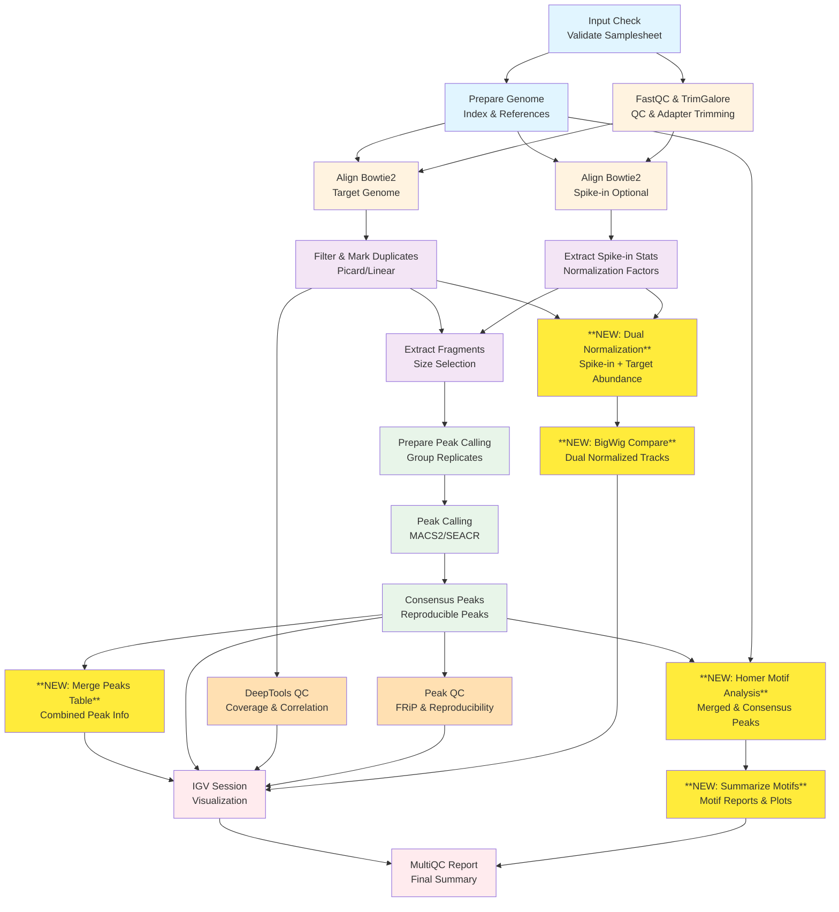

# Pipeline DAG Documentation

**Generated:** February 9, 2026  
**Author:** Katharina Hayer (khayer)  
**Co-created with:** GitHub Copilot (Claude Sonnet 4.5)

## Overview

This directory contains Directed Acyclic Graph (DAG) visualizations of the Cut&Run pipeline workflow, showing both the original nf-core pipeline and the modified version with custom additions.

## Files in This Directory

- `flowchart.html` - Interactive HTML visualization of the complete pipeline DAG
- `flowchart.png` - Static PNG image of the complete pipeline DAG (requires Graphviz)

## Pipeline Versions

### BEFORE - Original nf-core/cutandrun Pipeline

The baseline nf-core pipeline (commit: `6e1125d`) includes:
- Input validation and genome preparation
- Quality control with FastQC and TrimGalore
- Bowtie2 alignment to target genome
- Optional spike-in alignment for normalization
- Duplicate marking (Picard or linear)
- Fragment extraction and size selection
- Peak calling (MACS2/SEACR)
- Consensus peak generation
- DeepTools QC and correlation analysis
- Peak quality metrics (FRiP, reproducibility)
- IGV session generation
- MultiQC reporting



### AFTER - Modified Pipeline with Custom Features

Custom additions (commits: `92fa7a6`, `7fbbf1b`) add advanced normalization and motif analysis:

**New Features:**
1. **Dual Normalization** (`normalisation_mode_dual=true`)
   - Combines spike-in normalization with target genome read abundance
   - More robust normalization for complex experiments
   - Implemented in `subworkflows/local/prepare_peakcalling.nf`

2. **BigWig Compare** (DeepTools)
   - Generates dual-normalized BigWig tracks
   - Allows direct comparison between samples with combined normalization
   - Uses `DEEPTOOLS_BIGWIGCOMPARE` and `DEEPTOOLS_MULTIBAMSUMMARY_BED`

3. **Merge Peaks Table**
   - Consolidates peak information across all samples
   - Creates comprehensive peak annotation tables
   - Custom module: `modules/local/python/merge_peaks_table.nf`

4. **Homer Motif Analysis** (`--run_homer_motifs`)
   - Discovers enriched transcription factor binding motifs
   - Runs on both merged and consensus peaks
   - Custom modules:
     - `modules/local/homer/findmotifsgenome/main.nf`
     - `modules/local/python/summarize_homer_motifs.nf`
   - Generates HTML reports with motif logos and enrichment statistics



## How to Generate DAG Visualizations

### Method 1: HTML (Recommended - No Dependencies)

```bash
nextflow run main.nf \
  --input samplesheet.csv \
  --genome GRCh37 \
  -profile docker \
  -with-dag flowchart.html \
  -preview
```

### Method 2: PNG/PDF (Requires Graphviz)

```bash
# Install Graphviz first
sudo apt-get install graphviz  # Ubuntu/Debian
brew install graphviz          # macOS

# Generate PNG
nextflow run main.nf \
  --input samplesheet.csv \
  --genome GRCh37 \
  -profile docker \
  -with-dag flowchart.png \
  -preview
```

### Method 3: DOT Format (For Custom Styling)

```bash
# Generate DOT file
nextflow run main.nf \
  --input samplesheet.csv \
  --genome GRCh37 \
  -profile docker \
  -with-dag flowchart.dot \
  -preview

# Edit flowchart.dot to add custom styling
# Then convert to PNG
dot -Tpng flowchart.dot -o flowchart_custom.png
```

### Preview Mode

The `-preview` flag performs a dry-run that shows the workflow structure without executing tasks. This is useful for quickly generating DAGs without running the full pipeline.

### Full Pipeline DAG

To generate a DAG with your actual configuration:

```bash
./nextflow run main.nf \
  --input samplesheet_just2026.csv \
  --outdir results_dual_norm \
  --normalisation_mode Spikein \
  --normalisation_mode_dual true \
  --normalisation_c 10000 \
  -profile singularity \
  --fasta HSV17_genome_files/17_No_repeats.fasta \
  --bowtie2 /home/hayerk/data/index/weitzman_human_hsv/HSV17_genome/ \
  --gene_bed HSV17_from_gff.bed \
  --gtf HSV17_genome_files/17_No_repeats.gff \
  --macs_gsize 136000 \
  -work-dir work_dual_norm \
  --peakcaller macs2 \
  --run_homer_motifs true \
  -with-dag dag/flowchart.html \
  -preview
```

## DAG Customization

### Highlighting Specific Nodes

To highlight custom modules or processes, generate a DOT file and add styling:

```dot
// In flowchart.dot
"HOMER_FINDMOTIFSGENOME" [fillcolor=orange, style=filled, color=red, penwidth=2];
"MERGE_PEAKS_TABLE" [fillcolor=yellow, style=filled];
```

### Simplifying Complex DAGs

For large pipelines, consider:
- Using `-preview` to avoid runtime-specific branches
- Grouping processes by subworkflow
- Creating a separate high-level overview (see Mermaid diagrams above)

## Viewing DAG Files

- **HTML files**: Open directly in any web browser - interactive with zoom/pan
- **PNG files**: View with any image viewer
- **DOT files**: Edit with text editor, visualize with Graphviz tools

## Resources

- [Nextflow DAG Documentation](https://www.nextflow.io/docs/latest/tracing.html#dag-visualisation)
- [Graphviz Download](https://graphviz.org/download/)
- [Mermaid Live Editor](https://mermaid.live/)

## Change Log

### February 9, 2026
- Generated initial pipeline DAG visualizations
- Documented custom additions to nf-core/cutandrun pipeline
- Added before/after comparison diagrams
